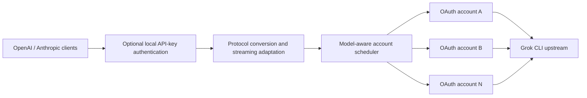

<div align="center">

# grokcli2api-go

**Expose the Grok CLI upstream as OpenAI- and Anthropic-compatible APIs**

A lightweight, deployable Go compatibility layer with streaming and multi-account scheduling

[](https://github.com/Futureppo/grokcli2api-go/actions/workflows/ci.yml)
[](https://go.dev/)
[](LICENSE)
[](https://github.com/Futureppo/grokcli2api-go/pkgs/container/grokcli2api-go)

[One-command deployment](#one-command-deployment-linux) · [Quick Start](#quick-start) · [API Compatibility](#api-compatibility) · [Configuration](#configuration) · [Endpoints](#endpoints) · [Contributing](#development-and-contributing)

[简体中文](README.md) · **English**

</div>

---

`grokcli2api-go` is an unofficial API compatibility service written in Go. It translates the upstream API used by Grok CLI into OpenAI Chat Completions, OpenAI Responses, and Anthropic Messages formats, allowing existing applications to connect by changing their API Base URL in most cases.

The project uses only the Go standard library at runtime and provides a multi-account OAuth credential pool, automatic token refresh, model discovery, session affinity, retries, and capacity backpressure. It is suitable for local development, internal services, and containerized deployments.

> [!IMPORTANT]
> This project is an unofficial compatibility layer and is not affiliated with or endorsed by xAI, X, OpenAI, or Anthropic. Users are responsible for complying with applicable terms of service and for any compatibility, availability, or account risks associated with using a non-public upstream API.

## Core Capabilities

| Category | Capabilities |
| --- | --- |
| API compatibility | OpenAI Chat Completions, OpenAI Responses, Anthropic Messages, and native Grok CLI Responses passthrough |
| Response modes | Streaming SSE and non-streaming responses for common SDKs and HTTP clients |
| Credential management | Multi-account OAuth pool, automatic refresh, directory hot reload, and atomic persistence |
| Smart scheduling | Official subscription-tier detection, paid-account preference, session affinity, capability-aware routing, retries, and quota cooldowns |
| Concurrency control | Per-account concurrency limits and capacity backpressure to reduce 429 retry storms |
| Model discovery | Per-account upstream catalogs with caching, aggregation, and deduplication |
| Access protection | One or more local API keys through Bearer, `x-api-key`, or `api-key` headers |
| Network support | HTTP, HTTPS, SOCKS5, and SOCKS5H outbound proxies with standard `NO_PROXY` rules |
| Deployment | Single binary, graceful shutdown, multi-stage Docker build, and Docker Compose configuration |

## How It Works



The service derives the official subscription tier from OAuth tokens. New requests without an existing affinity prefer paid accounts that advertise the requested model, then fall back to free or unknown-tier accounts when paid accounts are unavailable.

## API Compatibility

| Protocol | Endpoint | Streaming | Non-streaming |
| --- | --- | :---: | :---: |
| OpenAI | `POST /v1/chat/completions` | ✓ | ✓ |
| OpenAI | `POST /v1/responses` | ✓ | ✓ |
| Anthropic | `POST /v1/messages` | ✓ | ✓ |
| OpenAI | `GET /v1/models` | — | ✓ |

The compatibility layer preserves commonly used request fields, response structures, and streaming events where possible, but it does not guarantee support for every parameter or behavior of the official APIs. When integrating through an API aggregation project such as New API, enable **passthrough** for all request parameters.

### Chat Completions request sanitization

Before forwarding `POST /v1/chat/completions`, the service rebuilds the body using the Grok CLI upstream request shape. It supports messages, text/image content, function tools, structured output, search parameters, and reasoning effort. Common aliases are mapped to their upstream forms, including `max_completion_tokens` → `max_tokens`, `functions` → `tools`, `function_call` → `tool_choice`, and `user` → `user_id`. Undeclared top-level fields and nested client metadata are removed; sanitized paths are recorded only at `DEBUG` level and field values are never logged.

Malformed content or broken message/tool-call relationships return an OpenAI-shaped local `422 invalid_request_error`. The `grok-4.5*` and `composer` model families also drop unsupported sampling penalties and stop parameters.

### Responses format selection

`POST /v1/responses` uses the OpenAI Responses API format by default. Request fields are sanitized against the Grok CLI 0.2.99 Responses types, while Grok-native extensions are removed from non-streaming responses and SSE events. Native passthrough is enabled only for an explicit Grok CLI identity: `X-XAI-Token-Auth: xai-grok-cli`, `x-grok-client-version`, a recognized Grok client name/identifier, or a `grok-cli/`, `grok-shell/`, or `grok-pager/` User-Agent. Arbitrary or unknown `x-grok-client-*` values do not select the native format.

When `store` is omitted, the compatibility branch follows the OpenAI default and sends `store: true`. Later requests can continue with `previous_response_id` and are pinned to the upstream account that created the Response; one Response ID may be used for multiple independent branches. Account affinity and tool-replay state are in-memory and do not survive a service restart. With explicit `store: false`, an ordinary previous ID produces the upstream not-found error. Function-tool continuations can still use a cached minimal call shape while the cache entry is alive; user text and images are not additionally cached.

The supported surface includes text, multi-turn state, Function/custom/namespace/tool-search tools, parallel tool results, Web Search, HTTPS or Base64 data URI images, `text.format.json_schema`, and typed SSE. Invalid requests return `400 invalid_request_error` with an exact `param` path; bodies over 16 MiB return `413`. The proxy does not currently provide `/v1/conversations`, `/v1/files`, audio, background-task polling, image-generation output, or managed tool execution other than Web Search. Those parameters return an explicit `unsupported_parameter` instead of being silently dropped.

`POST /v1/messages` remains Anthropic-shaped externally and executes through the upstream Responses API. Anthropic `metadata.user_id` maps to the Responses `safety_identifier`; `stop_sequences`, which the Responses request cannot represent, is not forwarded and produces a compatibility warning.

## Quick Start

### One-command deployment (Linux)

If Docker and Docker Compose v2 are already installed on the server, run:

```bash
bash <(curl -fsSL https://raw.githubusercontent.com/Futureppo/grokcli2api-go/main/scripts/deploy.sh)
```

The script checks Docker, downloads the Compose configuration, creates a protected `.env` file and `auths/` directory, generates separate random local and administrator API keys, and starts and verifies the service. An interactive run can import an OAuth JSON file immediately or start with an empty credential pool so that a credential can be uploaded through the administrator API. Existing installations retain their `.env` and credentials, so the same command also updates the container image.

For unattended deployment, provide the inputs as environment variables:

```bash
AUTH_FILE=/root/account.json \
GROK_API_KEYS='sk-change-this-to-a-strong-random-key' \
GROK_ADMIN_KEY='adm-use-an-independent-strong-random-key' \
INSTALL_DIR=/opt/grokcli2api-go \
bash <(curl -fsSL https://raw.githubusercontent.com/Futureppo/grokcli2api-go/main/scripts/deploy.sh)
```

Optional variables include `GROK2API_PORT` (default `8088`), `INSTALL_DIR` (default `~/grokcli2api-go`), `AUTH_FILE`, `GROK_API_KEYS`, and `GROK_ADMIN_KEY`. The administrator API is enabled by default. Set `ENABLE_ADMIN_API=0` to disable it; without a local credential, that mode initializes the configuration without starting the service.

> [!TIP]
> The deployment script does not obtain upstream credentials for you. OAuth JSON is sensitive: export it only from a trusted source and store it with least-privilege permissions. Configure HTTPS, a reverse proxy, access controls, and rate limiting before exposing the service publicly.

### 1. Prepare the Project

You will need:

- Docker and Docker Compose, or Go 1.23 or later;
- at least one valid Grok CLI OAuth JSON credential, or an administrator key for uploading one through the API; and
- a writable credential directory.

```bash
git clone https://github.com/Futureppo/grokcli2api-go.git
cd grokcli2api-go
cp .env.example .env
mkdir auths
```

Windows PowerShell:

```powershell
git clone https://github.com/Futureppo/grokcli2api-go.git
Set-Location grokcli2api-go
Copy-Item .env.example .env
New-Item -ItemType Directory -Force auths
```

Place each account's OAuth JSON file directly under `auths/`, with one account per file:

```text
auths/
├── account-1.json
├── account-2.json
└── account-n.json
```

Credentials typically need a usable access token, refresh metadata, and a stable account identity. The service scans only the first level of this directory and does not search subdirectories recursively.

> [!CAUTION]
> `auths/` is ignored by Git, but it must still be treated as a sensitive directory. The service hot-reloads credentials and writes refreshed tokens and model catalogs back to their original files, so the directory and files must be writable.

### 2. Configure a Local Access Key

Edit `.env` and replace the example value with a strong random key used only by your clients:

```dotenv
GROK_API_KEYS=sk-kfcvivo50
```

Local API keys protect this service and are separate from upstream OAuth credentials. Leaving the value empty disables access protection, which is not recommended in any environment reachable by other devices.

### 3. Start the Service

#### Docker Compose (recommended)

```bash
docker compose up -d
docker compose ps
```

View logs or stop the service:

```bash
docker compose logs -f
docker compose down
```

#### Run from source

```bash
go run ./cmd/grok2api
```

#### Use the prebuilt image

```bash
docker pull ghcr.io/futureppo/grokcli2api-go:latest
docker run --rm -p 8088:8088 --env-file .env \
  -v "$(pwd)/auths:/auths" \
  -e GROK_AUTHS_DIR=/auths \
  ghcr.io/futureppo/grokcli2api-go:latest
```

Docker Compose pulls and runs `ghcr.io/futureppo/grokcli2api-go:latest` by default. Every push publishes a `sha-<commit>` tag and a matching branch tag; pushes to `main` also update `latest`.

### 4. Verify the Service

The service listens on `http://0.0.0.0:8088` by default. Replace the key below with the value configured in `.env`:

```bash
curl http://localhost:8088/

curl http://localhost:8088/v1/models \
  -H "Authorization: Bearer sk-kfcvivo50"
```

## Usage Examples

The examples below use `sk-kfcvivo50` as a placeholder. Replace it with your local API key.

### OpenAI Chat Completions

```bash
curl http://localhost:8088/v1/chat/completions \
  -H "Content-Type: application/json" \
  -H "Authorization: Bearer sk-kfcvivo50" \
  -d '{
    "model": "grok-4.5",
    "messages": [
      {"role": "user", "content": "Hello!"}
    ]
  }'
```

### OpenAI Responses

```bash
curl http://localhost:8088/v1/responses \
  -H "Content-Type: application/json" \
  -H "Authorization: Bearer sk-kfcvivo50" \
  -d '{
    "model": "grok-4.5",
    "input": "Explain what an API compatibility layer does."
  }'
```

For a default stateful conversation, retain only the previous response ID:

```bash
FIRST_ID=$(curl -s http://localhost:8088/v1/responses \
  -H "Content-Type: application/json" \
  -H "Authorization: Bearer sk-kfcvivo50" \
  -d '{"model":"grok-4.5","input":"Remember that my code is 7319."}' | jq -r .id)

curl http://localhost:8088/v1/responses \
  -H "Content-Type: application/json" \
  -H "Authorization: Bearer sk-kfcvivo50" \
  -d "{\"model\":\"grok-4.5\",\"previous_response_id\":\"$FIRST_ID\",\"input\":\"What is my code?\"}"
```

Images can use an HTTPS URL or a Base64 data URI while preserving mixed text/image order:

```json
{
  "model": "grok-4.5",
  "input": [{
    "type": "message",
    "role": "user",
    "content": [
      {"type": "input_text", "text": "Describe this image."},
      {"type": "input_image", "image_url": "https://example.com/image.png", "detail": "high"}
    ]
  }]
}
```

For a Function result, use the `call_id` returned by the first turn and pass that turn's Response ID as `previous_response_id`:

```json
{
  "model": "grok-4.5",
  "previous_response_id": "resp_...",
  "input": [{"type": "function_call_output", "call_id": "call_...", "output": "sunny, 26 C"}],
  "tools": [{"type": "function", "name": "get_weather", "parameters": {"type": "object", "properties": {"city": {"type": "string"}}, "required": ["city"]}}]
}
```

### Anthropic Messages

```bash
curl http://localhost:8088/v1/messages \
  -H "Content-Type: application/json" \
  -H "x-api-key: sk-kfcvivo50" \
  -H "anthropic-version: 2023-06-01" \
  -d '{
    "model": "grok-4.5",
    "max_tokens": 512,
    "messages": [
      {"role": "user", "content": "Hello!"}
    ]
  }'
```

If neither `GROK_API_KEYS` nor `GROK_API_KEY` is configured, remove the local API-key header from these examples.

## Session Affinity and Account Scheduling

When multiple clients share one local API key, send a stable, non-sensitive identifier for each conversation:

```http
X-Grok-Session-ID: conversation-123
```

The service also recognizes the following fields as affinity identifiers, in order:

- OpenAI `previous_response_id`
- OpenAI `prompt_cache_key`
- OpenAI `user`
- Anthropic `metadata.user_id`

Local API keys and client IP addresses are never used for account affinity. Affinity mappings are stored only in memory and are bounded by a TTL and maximum capacity.

New requests without an existing affinity rotate across available paid accounts first. The scheduler uses free or unknown-tier accounts only when paid accounts do not advertise the model, are disabled, are cooling down, or have reached their concurrency limit. Existing affinity still wins to preserve multi-turn and `previous_response_id` continuity.

The administrator credential API returns `subscription_tier` and `subscription_tier_display` using the official CLI mapping for the JWT `tier` claim:

| JWT `tier` | `subscription_tier` | Display name |
| ---: | --- | --- |
| 0 | `free` | Free |
| 1 | `supergrok` | SuperGrok |
| 2 | `x_basic` | X Basic |
| 3 | `x_premium` | X Premium |
| 4 | `x_premium_plus` | X Premium+ |
| 5 | `supergrok_heavy` | SuperGrok Heavy |
| 6 | `supergrok_lite` | SuperGrok Lite |

The tier is derived from the current access token and updates after OAuth refresh without adding derived fields to the credential file. Both fields are omitted when the token has no tier claim. Unknown positive numeric tiers retain their numeric label and join the paid-preference group, matching the official CLI's fail-open policy for future tiers.

## Configuration

The service loads environment variables that are not already set from a `.env` file in the current working directory. See [`.env.example`](.env.example) for the complete template and advanced client-identity options.

### Server

| Environment variable | Default when unset | Description |
| --- | --- | --- |
| `GROK2API_HOST` | `0.0.0.0` | Service bind address |
| `GROK2API_PORT` | `8088` | Service bind port |
| `GROK2API_LOG_LEVEL` | `INFO` | `DEBUG`, `INFO`, `WARN`, or `ERROR` |
| `GROK_API_KEYS` | empty | Comma-separated local access keys; separate keys may be assigned to different clients |
| `GROK_API_KEY` | empty | Backward-compatible alias for one local access key |
| `GROK_ADMIN_KEY` | empty | Independent administrator key; enables remote credential management and empty-pool startup |

When local access protection is enabled, protected endpoints accept any of these headers:

- `Authorization: Bearer <key>`
- `x-api-key: <key>`
- `api-key: <key>`

The administrator key is independent from normal API keys. Management endpoints accept `Authorization: Bearer <admin-key>` or `X-Admin-Key: <admin-key>` and should only be exposed through HTTPS on a restricted network. Upload a credential as a JSON request body:

```bash
curl http://localhost:8088/v1/admin/credentials \
  -H "Authorization: Bearer $GROK_ADMIN_KEY" \
  -H "Content-Type: application/json" \
  --data-binary @auth.json
```

Or upload it as a file form:

```bash
curl http://localhost:8088/v1/admin/credentials \
  -H "X-Admin-Key: $GROK_ADMIN_KEY" \
  -F "file=@auth.json;type=application/json"
```

The server derives a redacted ID from the credential's stable account identity. Uploading the same account again atomically replaces its existing credential. Model discovery runs immediately after upload; a temporary discovery failure does not remove the saved credential. Status responses also include the official subscription-tier key and display name derived from the JWT.

List redacted credential status:

```bash
curl http://localhost:8088/v1/admin/credentials \
  -H "X-Admin-Key: $GROK_ADMIN_KEY"
```

Delete a credential using the 24-character redacted ID returned by the list endpoint:

```bash
curl -X DELETE http://localhost:8088/v1/admin/credentials/<credential-id> \
  -H "X-Admin-Key: $GROK_ADMIN_KEY"
```

Administrator responses include `Cache-Control: no-store`. Uploads are limited to 1 MiB; the service validates the JSON, derives the destination from the account identity, and atomically writes it with mode `0600` instead of trusting the client filename. Prefer administration over loopback or an SSH tunnel. Cross-network access must use HTTPS with source and rate restrictions at the reverse proxy.

### Credential Pool and Scheduling

| Environment variable | Default when unset | Description |
| --- | --- | --- |
| `GROK_AUTHS_DIR` | `./auths` | Writable, non-recursive OAuth JSON directory |
| `GROK_AUTHS_RELOAD_INTERVAL` | `30s` | Credential directory hot-reload interval |
| `GROK_AUTH_REFRESH_CONCURRENCY` | `4` | Maximum concurrent OAuth refreshes |
| `GROK_ACCOUNT_MAX_INFLIGHT` | `16` | Maximum upstream requests in flight per account; excess requests wait for capacity |
| `GROK_MODELS_REFRESH_INTERVAL` | `6h` | Per-account model-catalog refresh interval |
| `GROK_BILLING_REFRESH_INTERVAL` | `5m` | Credits refresh interval for higher tiers with official usage support |
| `GROK_RETRY_MAX_ATTEMPTS` | `3` | Maximum number of distinct accounts tried per request |
| `GROK_RETRY_BASE_DELAY` | `200ms` | Base delay for retryable network and upstream 5xx failures |
| `GROK_RATE_LIMIT_COOLDOWN` | `1m` | Cooldown when an upstream 429 omits `Retry-After` |
| `GROK_QUOTA_COOLDOWN` | `24h` | Default cooldown after quota exhaustion |
| `GROK_AFFINITY_TTL` | `1h` | Lifetime of in-memory session-affinity mappings |
| `GROK_AFFINITY_MAX_ENTRIES` | `100000` | Maximum number of affinity-cache entries |

Free-model quota cooldowns are isolated by account and model. An exhausted spending limit cools down the entire account. Higher tiers on which the official client exposes usage also poll `billing?format=credits`; Free and X Basic are not proactively polled. Proactive cooldown occurs only when included usage reaches 100% and neither on-demand nor prepaid credit remains; the cooldown lasts until the server-provided period end. A recovered balance clears only the `billing_exhausted` cooldown created by this probe, never a 429, authentication, model-level, or other upstream cooldown. The redacted snapshot is kept in memory and exposed through the administrator credential status `billing` field; it is not written to OAuth files.

Scheduling distinguishes known paid tiers from free or unknown tiers; it does not assume that larger numeric tier claims represent higher plans.

### Upstream and Network

| Environment variable | Default when unset | Description |
| --- | --- | --- |
| `GROK_CHAT_PROXY_BASE_URL` | `https://cli-chat-proxy.grok.com` | Grok CLI upstream URL |
| `GROK_CHAT_PROXY_VERSION` | `v1` | Upstream API version |
| `GROK_STREAM_COMPRESSION` | `identity` | `identity` avoids buffering SSE through gzip; `gzip` is a compatibility fallback |
| `GROK_PROXY_URL` | empty | HTTP(S), SOCKS5, or SOCKS5H outbound proxy |
| `GROK_NO_PROXY` | empty | Comma-separated proxy bypass rules |
| `GROK_TLS_INSECURE_SKIP_VERIFY` | `false` | Disable upstream TLS verification; controlled debugging only |

When `GROK_PROXY_URL` is unset, the service honors the standard `HTTP_PROXY`, `HTTPS_PROXY`, `ALL_PROXY`, and `NO_PROXY` environment variables.

For example, to use a local HTTP proxy on port `7890`:

```dotenv
GROK_PROXY_URL=http://127.0.0.1:7890
GROK_NO_PROXY=localhost,127.0.0.1
```

The `-host` and `-port` command-line flags override the corresponding environment variables. Use `-version` to print the current version:

```bash
go run ./cmd/grok2api -host 127.0.0.1 -port 8088
go run ./cmd/grok2api -version
```

## Endpoints

### Compatible APIs

| Method | Path | Authentication | Description |
| --- | --- | :---: | --- |
| `GET` | `/` | No | Service name, version, and project URL |
| `GET` | `/v1/models` | Optional | Deduplicated union of model catalogs from all valid accounts |
| `GET` | `/v1/models/{model_id}` | Optional | Details for a specific model |
| `GET` | `/v1/auth/api-key` | No | Local API-key protection status |
| `POST` | `/v1/chat/completions` | Optional | OpenAI-compatible Chat Completions |
| `POST` | `/v1/responses` | Optional | OpenAI-compatible Responses |
| `POST` | `/v1/messages` | Optional | Anthropic-compatible Messages |

“Optional” means authentication is required only when a local API key has been configured.

### Administrator Credential APIs

These endpoints are registered only when `GROK_ADMIN_KEY` is set, and normal API keys cannot access them. List responses never expose account subjects, file paths, client IDs, or tokens.

| Method | Path | Description |
| --- | --- | --- |
| `GET` | `/v1/admin/credentials` | List redacted credential status, official subscription tiers, and model catalogs |
| `POST` | `/v1/admin/credentials` | Upload or replace a JSON credential using a JSON body or multipart `file` field |
| `DELETE` | `/v1/admin/credentials/{id}` | Delete a credential and immediately remove it from scheduling |

### Read-only Grok Passthrough APIs

| Method | Path |
| --- | --- |
| `GET` | `/v1/grok/settings` |
| `GET` | `/v1/grok/user` |
| `GET` | `/v1/grok/billing` |
| `GET` | `/v1/grok/mcp/configs` |
| `GET` | `/v1/grok/mcp/tools/list` |
| `GET` | `/v1/grok/feedback/config` |

At startup, the service reads cached model catalogs from credential JSON files and requests upstream `/v1/models` for accounts whose catalog is missing or older than the refresh interval. Newly hot-loaded accounts are discovered automatically. Normalized `models` and `models_updated_at` fields are persisted to the corresponding credential files and preserved during token refresh.

Actual model availability is always controlled by the upstream account. Query `/v1/models` before generating content and use the exact model ID returned by the service.

## Docker and Image Design

The project image uses a multi-stage build: the build stage runs the complete test suite and produces a CGO-free binary, while the runtime stage uses a non-root user and a minimal Alpine base image. The Compose configuration also enables a read-only root filesystem, drops Linux capabilities, sets `no-new-privileges`, and defines a health check by default.

Local `.env` and `auths/` data remain external configuration and credential storage. Rebuilding or recreating the container does not bake them into the image.

## Security

- Never commit or disclose OAuth tokens, API keys, authentication files, or unsanitized logs.
- Configure `GROK_API_KEYS` before exposing the service to a network, and enable HTTPS, access control, and rate limiting at the reverse proxy.
- When enabling `GROK_ADMIN_KEY`, use a separate strong random key and apply additional source-address and rate restrictions to the management endpoints.
- Apply least-privilege file permissions to the credential directory and restrict which system users can access it.
- Do not enable `GROK_TLS_INSECURE_SKIP_VERIFY` outside a controlled debugging environment.
- Do not use session IDs, email addresses, or other sensitive data directly as affinity identifiers.
- Report vulnerabilities privately through [GitHub Security Advisories](https://github.com/Futureppo/grokcli2api-go/security/advisories/new).

## Development and Contributing

### Local Checks

```bash
gofmt -w path/to/changed.go
go test ./...
go test -race ./...
go vet ./...
go build ./cmd/grok2api
```

> `go test -race ./...` requires a platform supported by the Go Race Detector. The project CI runs this check on Linux.

### Live Load Testing

The project includes an opt-in live upstream load test that reports response headers, first event, first non-empty text, completion latency, and sample coverage:

```bash
GROK_LIVE_LOAD=1 GROK_LOAD_MODEL=grok-4 GROK_LOAD_STREAM=1 \
GROK_LOAD_WARMUP=4 GROK_LOAD_CONCURRENCY=4 GROK_LOAD_REQUESTS=16 \
GROK_LOAD_API=responses GROK_LOAD_AFFINITY=cache \
go test ./internal/server -run TestLiveGenerationLoad -v
```

- `GROK_LOAD_API`: `responses`, `chat`, or `anthropic`
- `GROK_LOAD_AFFINITY`: `none`, `session`, or `cache`
- `GROK_LOAD_INPUT_BYTES`: generate a test input of the specified size in bytes

Set `GROK2API_LOG_LEVEL=DEBUG` to inspect segmented timing logs that omit credentials, request bodies, and session identifiers.

Read [CONTRIBUTING.md](CONTRIBUTING.md) before submitting changes. Report bugs and feature requests through [GitHub Issues](https://github.com/Futureppo/grokcli2api-go/issues). Pull requests should remain focused and include tests for protocol conversion, streaming events, or error handling as appropriate.

## License

This project is licensed under the [GNU Affero General Public License v3.0](LICENSE). When using, modifying, or distributing this project, comply with the corresponding license obligations.

---

<div align="center">

If this project helps you, contributions, issues, and stars are always welcome ⭐.

</div>
